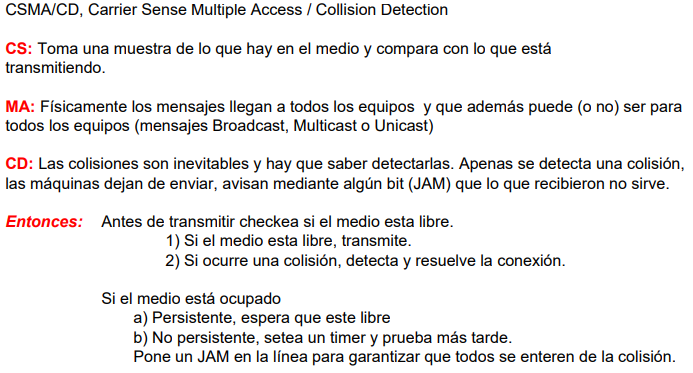
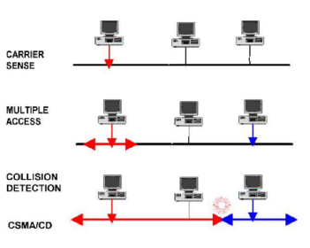
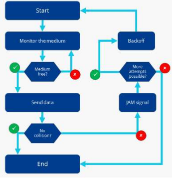
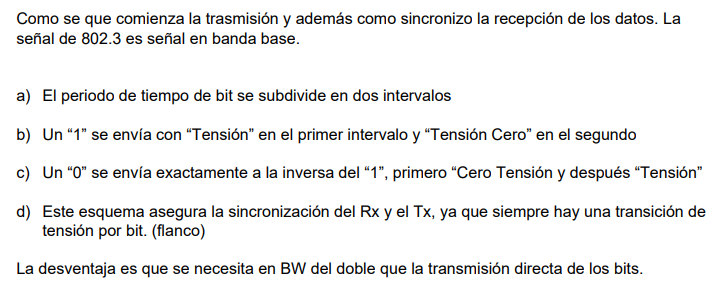
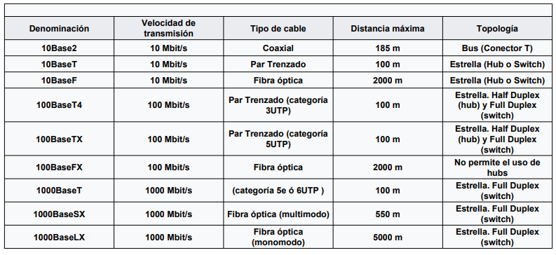
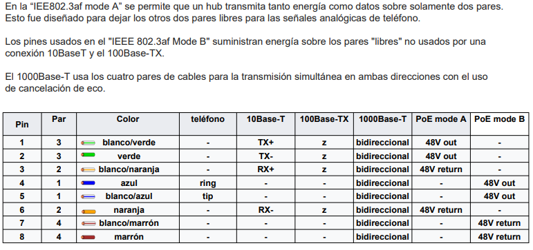
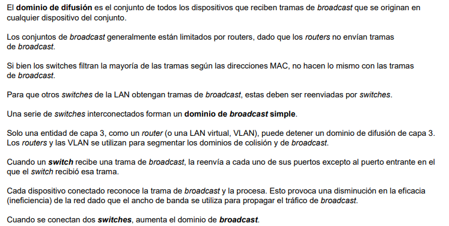
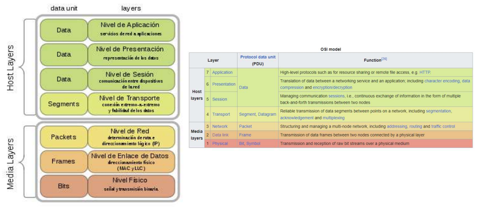
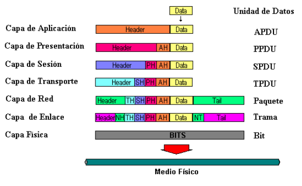
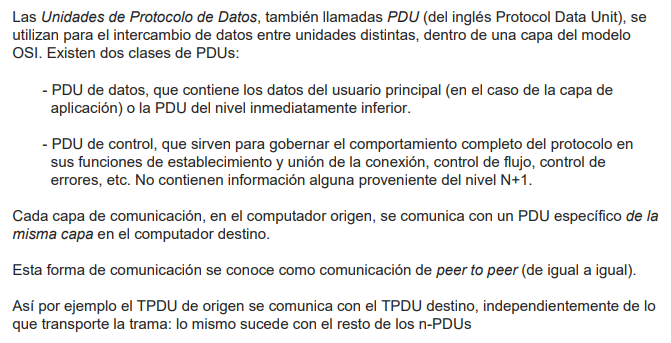

# Redes LAN - Clase 3 08/04/2025

## Preguntas Seguimiento de la Clase 2

### 1. Clasificacion de Redes LAN:
   - Segun Topologia:
      - Ethernet
      - Anillo (Token Ring)
      - Punto a punto
      - Bus
      - Mesh (malla)
   - Segun la Transmision:
      - Half-Duplex
      - Full-Duplex

### 4. ¿Que significa en una red LAN hablar de balanceado-asincronico y de desbalanceado-sincronico? ¿Esta relacionado con el sincronismo a nivel físico?
- **Balanceado**: no existen jerarquias, todos pueden conectarse con todos. Es **asincronico** porque pueden comunicarse los equipos cuando ellos lo requieran, sin jerarquias ni arbitraje.
- **Desbalanceado**: hay una jerarquia, existe el master y el slave. Es **sincronico** porque no pueden transmitir/recibir los equipos cuando ellos quieren sino que son gobernados por el master.

En cualquier caso, estas categorias no estan relacionadas con el sincronismo fisico. El sincronismo fisico se da a nivel de señales electricas. En este caso, habla de como esta organizado el trafico de red.

### 5. Sincronismo en cable UTP

- Se utiliza la codificacion Manchester, la misma esta embebida en la transmision de los datos

## Trama Ethernet

### MAC
Trama de 6 bytes en hexa que se utiliza para direccionar a nivel 2 del modelo OSI

### Checksum
Es un polinomio que se utiliza para CRC, chequeo de errores.

### CSMA/CD

#### Diagrama de Funcionamiento

## Codificacion Manchester

## Nivel Fisico en redes Ethernet hasta 1GB

El numero inicial (10, 100, 1000) indica la velocidad de la conexion.

### Power on Ethernet (POE)

## Nivel Fisico en redes Ethernet hasta 10GB

**10 Gigabit Ethernet (XGbE o 10GbE)**
- El estándar 10 Gigabit Ethernet contiene siete tipos de medios para LAN, MAN y WAN.
- Ha sido especificado en el estándar suplementario IEEE 802.3ae,
- Hay diferentes estándares para el nivel físico (PHY) . La letra X significa codificación 8B/10B y se usa para interfaces de cobre.
- La variedad óptica más común se denomina LAN PHY, usada para conectar routers y switches entre sí.
- Aunque se denomine como LAN se puede usar con 10GBase-LR y 10GBase-ER hasta 80 km.
- LAN PHY usa una velocidad de línea de 10.3 Gbit/s y codificación 66B (1 transición cada 66 bits al menos).
- WAN PHY (marcada con una W) encapsula las tramas Ethernet para la transmisión sobre un canal SDH/SONET STS-192c

## Dispositivos de Networking

**Nivel 1**: no tiene logica, las conexiones son fisicas. **Tienen colisiones**
- **Repetidores**: amplifica y regenera la señal
- **HUBs**: evolución del repetidor, transforma una conexión BUS en Estrella, en sentido físico, pero lógicamente es un BUS

**Nivel 2**: **no habra colisiones.** Direcciona a nivel de MAC. Tendra problemas de **broadcast** ya que no puede controlar en que estado estara cada equipo de la red cuando repita el broadcast.
- **Bridges**: analiza la trama MAC y repite solo cuando tiene sentido repetir El bridge separa la red en dominios de colisión. Aprende donde está cada maquina y completa sus tablas de direccionamiento. Lo bridges no saben nada de LLC
- **Switches**: es como un HUB inteligente, en cada boca de conexión tiene una tabla, El switch solo envía por la boca correspondiente y no por todas como lo hace el HUB.

**Nivel 3**: puede enrutar los paquetes por la red organizando el trafico en la misma, evitando que un equipo mandando continuamente broadcast sature la red. Los routers segmentan a nivel de redes, por lo que si hay un broadcast en una red, el mismo no va a salir de esa red y no va a haber colisiones con otros equipos que haya en otras redes
- **Routers**: encuentran la mejor ruta para conducir la informacion entre redes. Además, cumple la funcion de segmentar dominios de difusión o broadcast.
- **Gateways**: "adaptan" distintos protocolos entre una red y otra

### Dominios de Colision y Difusion

**Difusion == Broadcast**

## Paquetes y Segmentos - Unidades de Datos - Modelo OSI

Es clave la nomenclatura de cada unidad de dato segun el nivel en que se encuentre asi como la denominacion de los niveles en si misma.

### Diagrama "Cebolla"
De arriba a abajo se van agregando headers (como capas de cebolla) segun va pasando por los distintos niveles del modelo OSI.

## PDU - Protocol Data Units

