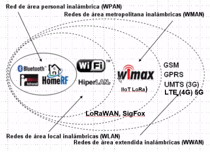
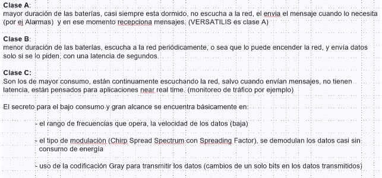

# Redes LAN - Clase 4 15/04/2025
# Redes Wireless Industriales y Móviles

## Tipos de arquitectura

- Estrella: si se cae un nodo puedo perder conexiones.
- Mesh: si cae un nodo, existen caminos preconfigurados para que el trafico de red siga entre los demas

## Prestaciones

- Seguridad: es mas segura la transmision por radio que por cable.
- Provisioning: es el acto de dar de alta un usuario. En este tipo de redes es muy facil

## Wireless Fija

LoRa WAN y SigFox (en Europa) son los tipos de red utilizados para comunicar sensores en IoT

## LoRa

Son redes inalambricas de muy bajo costo y alto rango (LoRa = long range). Sin embargo tiene tasa de transferencia relativamente baja, 242 bytes/seg.

Igualmente son sistemas muy atractivos para conectar nodos a grandes distancias manteniendo **muy bajo consumo** de energia, a la vez que un bajo costo.

Tienen un bajo ancho de banda.

La comunicacion suele ser unidireccional (del sensor hacia el controlador, por ejemplo)

### Perturbaciones

- Humedad: con la humedad se empeora la propagacion de las señales
- Viento: puede mover las antenas y generar *fading* (corrimientos de fase)

### LoRa WAN

Es el estandar sobre el que se arma la red LoRa

### Clases de Dispositivos (Sensores)

